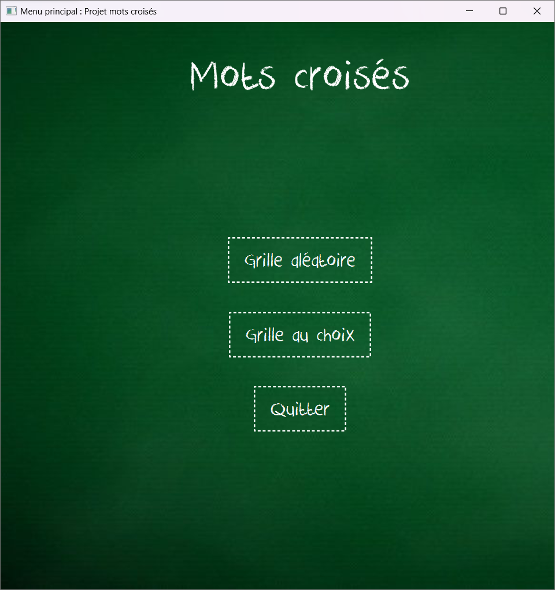
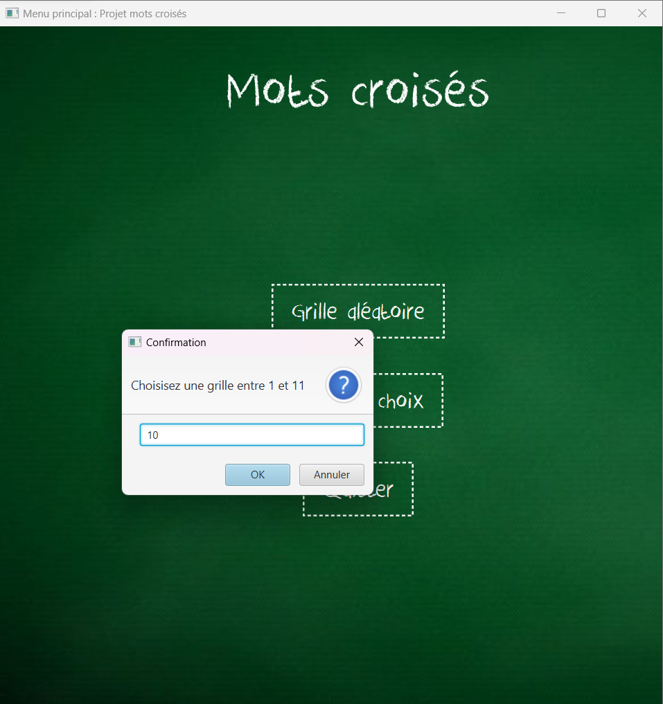
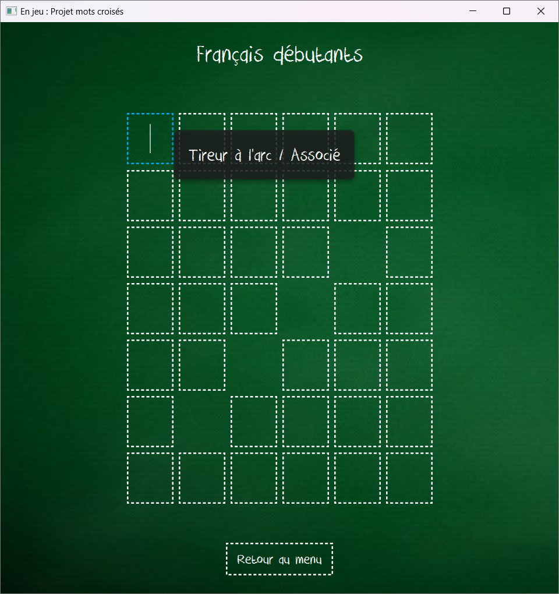
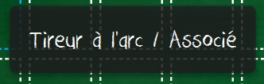
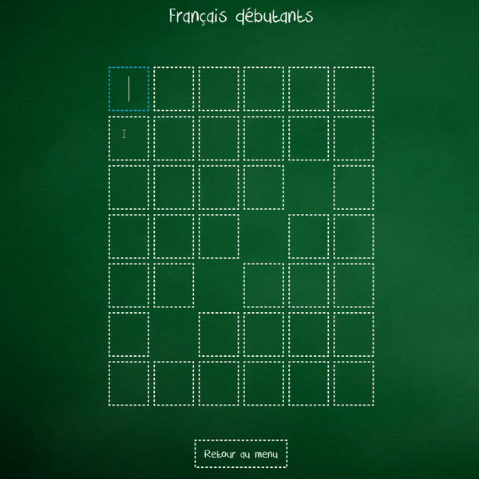
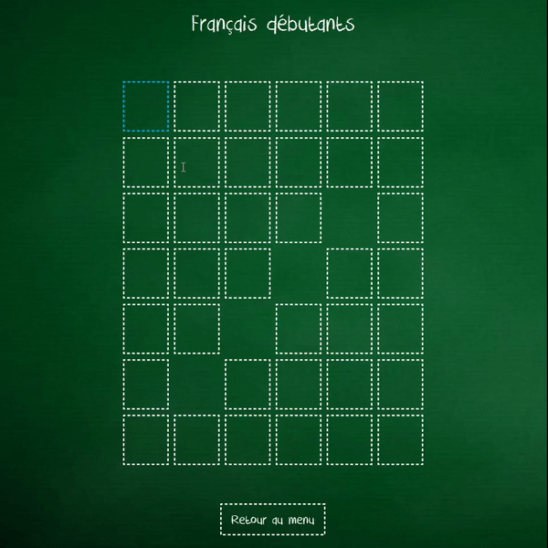
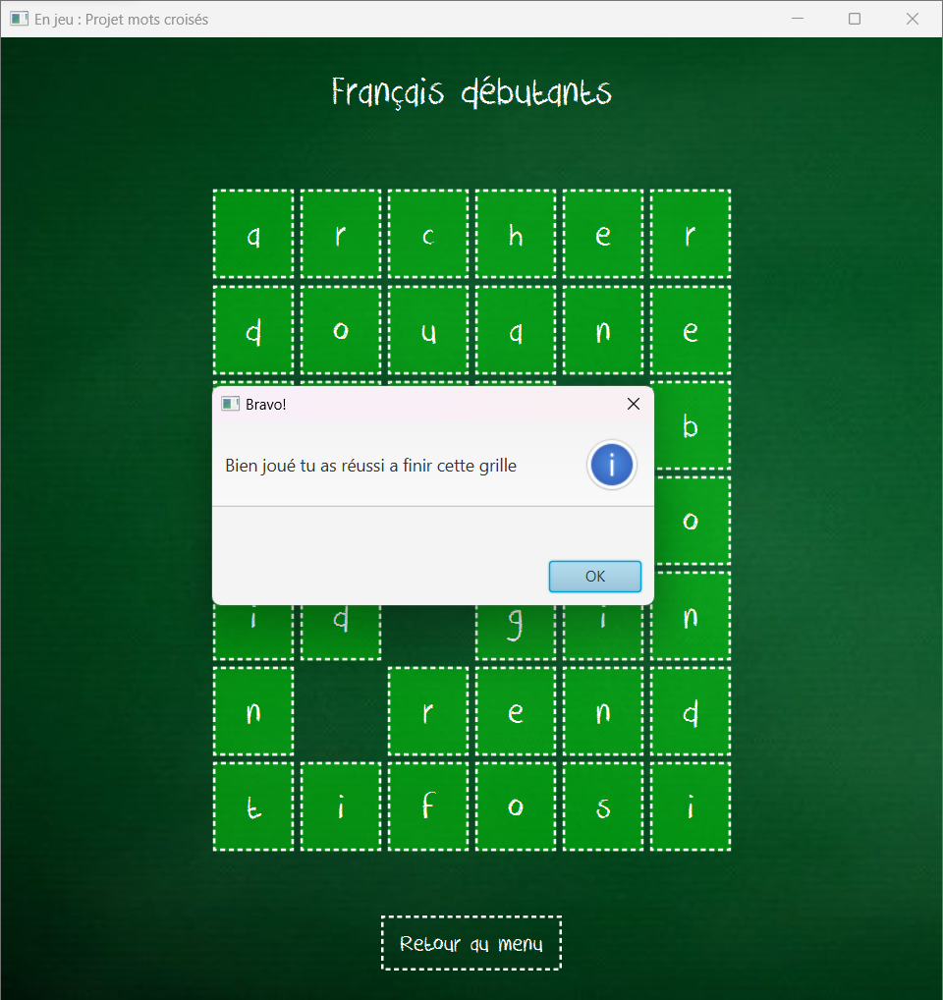

# MotsCroisesFX
Un jeu de mots croisés avec 11 grilles différentes (en anglais & français) et 3 niveaux de difficulté. 
L'interface graphique a été faite avec JavaFX en utilisant un pattern MVC.

  Menu principal
     
  

 
  Choix de la grille
 
  

  
Liste des grilles disponibles :
<table>
  <tr>
    <th>N°</th>
    <th>Intitulé</th>
    <th>Difficulté</th>
  </tr>
  <tr>
    <td>1 à 8</td>
    <td>Anglais</td>
    <td>Moyen<td>
  </tr>
  <tr>
    <td>9</td>
    <td>NYT</td>
    <td>Expert<td>
  </tr>
  <tr>
    <td>10</td>
    <td>Français</td>
    <td>Débutant<td>
  </tr>
  <tr>
    <td>11</td>
    <td>Français</td>
    <td>Impossible<td>
  </tr>
</table>

 

## Déroulement d'une partie

  Un cadre bleu apparait sur la case sélectionnée dans laquelle on veut ecrire une lettre. 
 
  

 
  Les définitions apparaissent en info-bulle quand le curseur est placé sur une case. [Définition horizontale / Définition verticale]
 
  

 
  Le cadre se deplace automatiquement vers la case suivante (horizontalement ou verticalement) quand on ecrit une lettre dans la case selectionnée
  et inversement quand on supprime une lettre.
  
  

 
  Appuyer sur la touche ENTER permet de vérifier si les lettres placées sont correctes, les cases sont colorées en vert si c'est le cas.
     
   

 
  Appuyer sur le clic central permet de dévoiler la solution d'une case.
  
  

  La partie se termine une fois que toutes les cases sont correctement remplies, une fenêtre de fin de partie apparait alors.
  
  
 

## Config ⚙️

Java 16+ & javafx sdk pour executer le programme 

Run src/motCroisee/v2/App.java 

